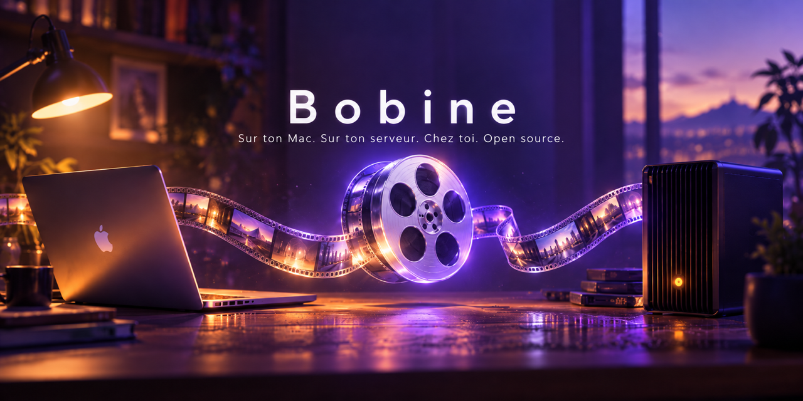
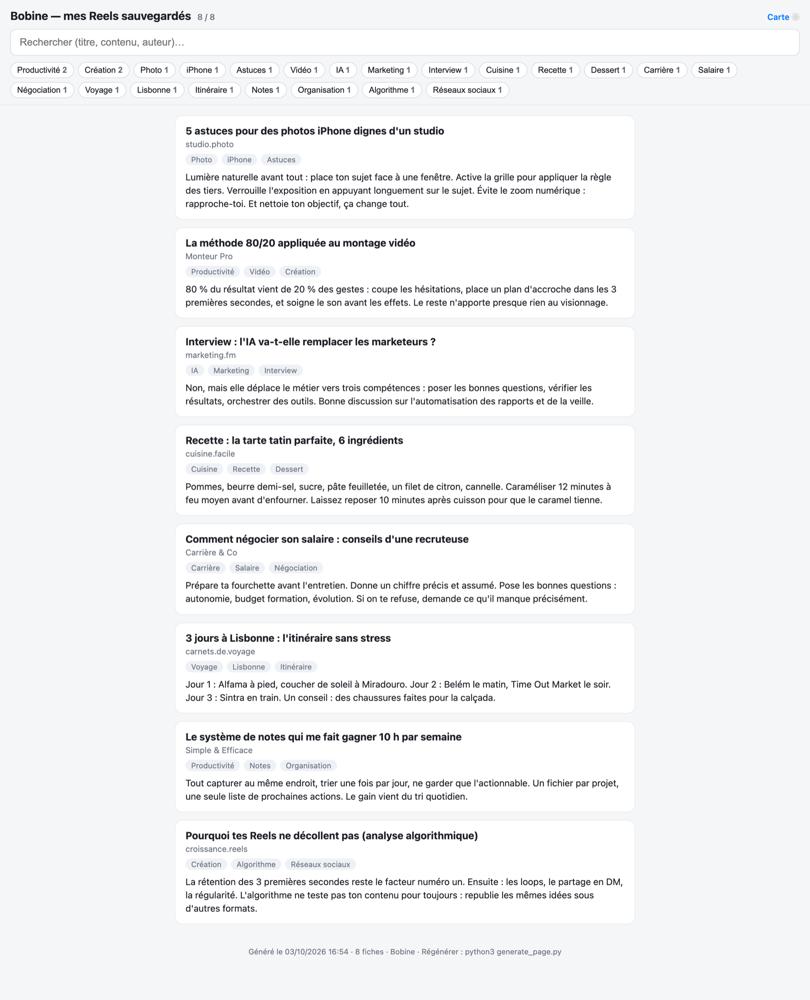
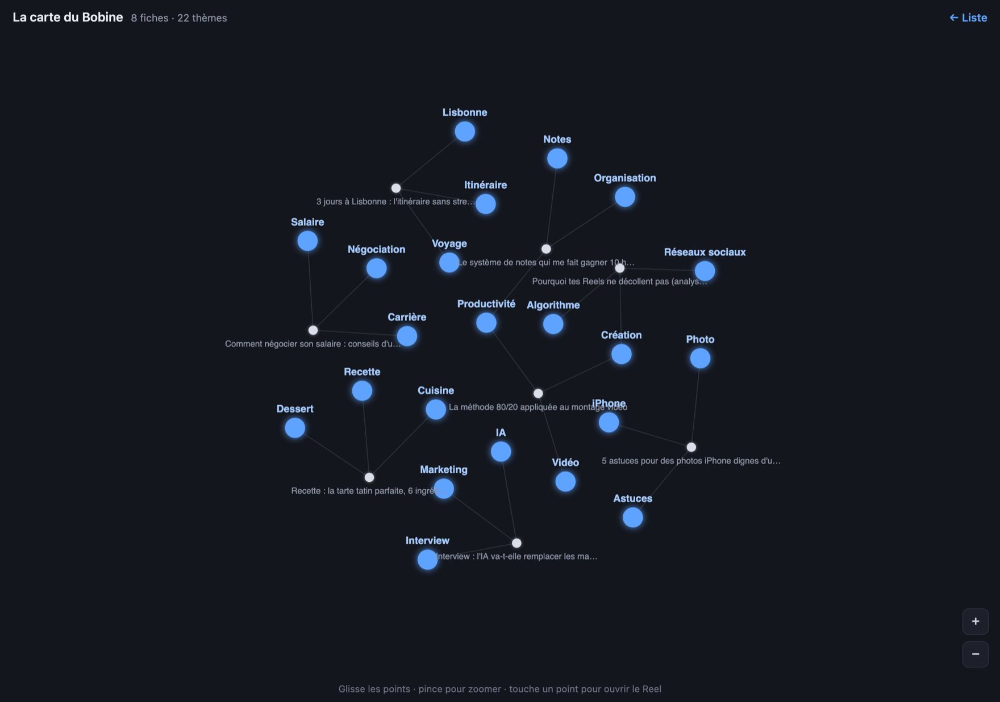
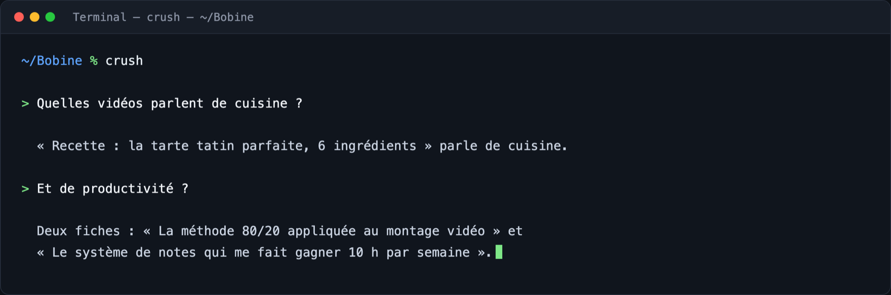

<div align="center">
  <sub>🌍 <b>Français</b> · <a href="README.en.md">English</a></sub>
  
  <h1>🎞️ Bobine</h1>
  <p><b>Tes Reels, et n'importe quelle vidéo TikTok/YouTube, sauvegardés deviennent une base de connaissances locale, cherchable et interrogeable. Sur ton Mac ou ton serveur, chez toi.</b></p>
  <p>
    <a href="https://github.com/wrouhli/bobine/releases"></a>
    <a href="LICENSE"></a>
    
    <a href="linux/README.md"></a>
    
    <a href="https://github.com/wrouhli/bobine/actions/workflows/tests.yml"></a>
  </p>
</div>

Tu partages une vidéo depuis ton iPhone. Quelques minutes plus tard, Bobine l'a téléchargée, transcrite, résumée et rangée dans une fiche. Le soir, tu ouvres une petite page web sur ton téléphone : tout est là, avec une recherche. **Et tout reste chez toi.**

> **Deux éditions, le même vault :**
> 🍎 **Mac + iPhone** : tu es au bon endroit. Télécharge le dossier, double-clique, c'est fini (iCloud, notifications, Crush).
> 🐧 **Linux / VPS**, la version serveur : installeur, réveil systemd, page en HTTPS → **[linux/](linux/README.md)**

> **📥 Tu viens de télécharger le dossier ?** Ouvre d'abord **« 👉 1. LIS-MOI D'ABORD (installation) »** : cette page t'accompagne clic par clic pendant l'installation (questions de sécurité de macOS comprises). Tout est aussi détaillé dans la section [Installation](#installation).

---

## Sommaire

- [Aperçu](#aperçu)
- [Comment ça marche](#comment-ça-marche)
- [Ce qu'il te faut](#ce-quil-te-faut)
- [Installation](#installation)
- [Ton Bobine au quotidien](#ton-bobine-au-quotidien)
- [Importer un export Instagram](#importer-un-export-instagram)
- [Les coûts](#les-coûts)
- [Dépannage : les classiques](#dépannage--les-classiques)
- [Désinstaller Bobine](#désinstaller-bobine)
- [La structure du projet](#la-structure-du-projet)
- [FAQ](#faq)
- [Contribuer](#contribuer)
- [Auteur](#auteur)
- [Licence](#licence)
- [Édition Linux / VPS](linux/README.md)

## Aperçu

**La page de ton Bobine.** Recherche instantanée, pastilles de thèmes, fiches avec résumés :



**La carte des thèmes.** Les sujets de ta collection, reliés entre eux :



**Et tu peux lui poser des questions** : « Quelles vidéos parlent de cuisine ? » L'assistant lit tes fiches et te répond *(voir « demander à ta collection », dans l'installation)*.

*(Toutes ces captures proviennent d'un Bobine de démonstration.)*

## Comment ça marche

```
iPhone                        Mac                                    iPhone
──────                        ───                                    ──────
Partager ───────►  boîte iCloud ──►  toutes les 15 min :          ┌► Fichiers → iCloud Drive
  (Instagram,     (inbox.txt)        1. relève la boîte           │    → Bobine
   TikTok,                           2. télécharge l'audio         │    → vault.html
   YouTube…)                         3. transcription locale       │      (recherche + résumés)
                                     4. résumé (ta clé API)        │
                                     5. fiches + page ─────────────┘
```

- **Transcription locale** (Whisper) : gratuite. Pour YouTube, Bobine récupère d'abord les **sous-titres** (récupération de quelques kilo-octets, en secondes) et ne transcrit que s'il n'y en a pas.
- **Résumés** : *facultatifs*, avec ta propre clé API (DeepSeek, OpenAI, OpenRouter…), Bobine écrit pour chaque fiche un titre, des thèmes et un résumé concret, met à jour l'index et régénère les pages.
- **Garde-fous** : jamais de rafale de téléchargements (15 par passage, 50 par jour maximum), jamais deux passages en même temps, un échec n'est retenté que 2 fois.

## Ce qu'il te faut

- un **Mac** + une connexion internet ;
- **Python 3.10 ou plus** (le script d'installation te guide) ;
- **ffmpeg** (`brew install ffmpeg`) ;
- *(facultatif, recommandé)* un **iPhone** pour le partage en un geste ;
- *(facultatif, recommandé)* une **clé API** pour les résumés : [DeepSeek](https://platform.deepseek.com) est le moins cher (quelques centimes pour des centaines de vidéos).

## Installation

L'installation est **interactive**, guidée du début à la fin : tu choisis le **nom** de ton vault et **où** l'installer, tu mets ta clé API si tu veux (facultatif), et Bobine fait le reste (environnement, dépendances, réveil automatique).

1. **Télécharge** ce dossier (« Code » → « Download ZIP »), puis décompresse-le (double-clic sur le fichier `.zip`).
2. Ouvre le dossier téléchargé et **commence par « 👉 1. LIS-MOI D'ABORD (installation) »** : cette page t'explique, clic par clic, les 2-3 questions de sécurité de macOS (c'est normal qu'il en pose, et c'est même sain).
3. **Double-clique sur « 👉 2. Installer Bobine.command »** et réponds aux questions (nom, emplacement, clé API facultative).
4. Si on te le demande : `brew install ffmpeg`.

> **🛡️ Les dialogues de macOS, en résumé** (tout est illustré, en images, dans la page ci-dessus) : clique **« Terminé »** (jamais « Placer dans la corbeille »), puis Réglages Système → **Confidentialité et sécurité** → « Ouvrir quand même », puis re-double-clique sur l'installateur.
>
> **Tu as cliqué « Placer dans la corbeille » ?** Pas de drame : clic droit sur le fichier dans la corbeille → « Remettre en place », ou re-décompresse le ZIP.

**Autre méthode, toujours fiable : en Terminal.** Place-toi dans le dossier téléchargé (astuce : tape `cd` suivi d'une espace, puis glisse le dossier dans la fenêtre du Terminal, et appuie sur Entrée), puis lance :

```bash
./install.sh    # bannière, questions guidées, environnement + dépendances...
```

À la fin, tout vit dans **le dossier de ton vault** (celui que tu as choisi) : tu peux alors supprimer le dossier téléchargé, il ne sert plus à rien.

*(Vérification facultative, dans le dossier de ton vault : `.venv/bin/python enrichir.py --dry-run`.)*

### *Facultatif* : la clé API des résumés

Ouvre `config.env` (créé par l'installation) et colle ta clé sur la bonne ligne :

```
DEEPSEEK_API_KEY=sk-…
```

C'est tout. Les autres lignes restent vides.

### *Recommandé* : le raccourci iPhone (partager en un geste)

Sur ton iPhone, app **Raccourcis** (« Shortcuts ») :

1. **+** → ajoute l'action « **Append to Text File** » (cherche « append ») ;
2. dans le champ texte : insère la variable « **Shortcut Input** » ;
3. **File Path** : écris exactement `inbox.txt` (laisse l'emplacement « Shortcuts » sur iCloud Drive) ;
4. active l'option « **New Line** » si elle apparaît ;
5. ⓘ → active « **Show in Share Sheet** », type : URLs uniquement ;
6. nomme-le « **Send to Bobine** ».

Usage : dans Instagram/TikTok/YouTube → **Partager → Send to Bobine**. C'est tout.

### *Recommandé* : demande à ta collection (Crush)

[Crush](https://charm.sh/crush) est un assistant qui vit dans le Terminal : léger, open source, sans compte à créer. Il utilise **la même clé API que tes résumés** : lancé dans le dossier de ton vault, il lit tes fiches pour répondre.



```bash
cd ~/Bobine    # le dossier de ton vault
crush
```

Puis pose tes questions en langage naturel : « Quelles vidéos parlent de cuisine ? », « Résume la vidéo sur le montage », « Quelles idées pour un post ? »… *(exemple dans l'image ci-dessus, sur un Bobine de démonstration.)*

*(L'installation prépare tout : le fichier `.crushrc` du dossier contient ta clé, le modèle DeepSeek et la lecture seule. Pas encore installé ? `brew install charmbracelet/tap/crush` : le script d'installation te l'a proposé.)*

## Ton Bobine au quotidien

- **Sur le Mac** : **double-clique sur « Ma page »** dans le dossier de ton vault (ou ouvre `vault.html`) : recherche, pastilles de thèmes, liens vers les vidéos.
- **Sur l'iPhone** : Fichiers → iCloud Drive → **Bobine** → `vault.html` (mis à jour à chaque nouveau lot ; la carte du graphe reste sur le Mac).
- **Pour poser des questions** : lance `crush` dans le dossier de ton vault (voir « Interroger ton vault »), ou lis les fiches directement : ce sont de simples fichiers Markdown dans `raw/` (un `grep`, Obsidian…).

## Importer un export Instagram

*Option avancée* : pour rattraper d'un coup des années de sauvegardes.

Si ton compte a des centaines (ou des milliers) de Reels gardés « pour plus tard », tout ingérer d'un coup serait des heures de transcription pour des fiches jamais relues. **`filtre.py` te laisse trier avant** : il lit ton export, applique tes règles, et seuls les posts retenus partent en transcription. Le tri suit **tes propres collections** : c'est ton rangement qui fait foi.

> 🛡️ **Côté compte, rien à craindre** : l'export se demande via l'outil officiel d'Instagram ; `filtre.py` ne se connecte à rien (tout est local) ; et l'ingestion garde sa cadence douce habituelle (une vidéo à la fois, 15 par passage).

**1.** Sur Instagram : **Paramètres → Centre des comptes → Vos informations et autorisations → Télécharger vos informations** (format **JSON**). Ça arrive par e-mail, parfois sous 48 h.

**2.** Décompresse l'archive et range-la quelque part à toi. Tu dois y voir `saved_posts.json` et `saved_collections.json`.

**3.** Dans le dossier de ton vault, génère ton fichier de tri, puis vérifie-le :

```bash
cd ~/Bobine     # le dossier de ton vault
.venv/bin/python filtre.py --export "CHEMIN/VERS/instagram-mon_compte" --init-config
.venv/bin/python filtre.py --export "CHEMIN/VERS/instagram-mon_compte" --rapport
```

`--init-config` écrit **`filtres.yaml`**, pré-rempli avec tes collections : ouvre-le et passe à `false` ce que tu ne veux pas voir atterrir (mèmes, pubs, citations…). `--rapport` montre le résultat de tes choix, motif par motif, avec des exemples, **sans rien lancer**. Les posts qu'aucune règle ne classe restent « à revoir » : jamais perdus, jamais ingérés par surprise.

**4.** Quand le rapport te plaît, produis la liste et lance la transcription (par lots, comme d'habitude) :

```bash
.venv/bin/python filtre.py --export "CHEMIN/VERS/instagram-mon_compte"
.venv/bin/python ingest.py liens-filtres.txt --vault . --cookies chrome --limite 10
.venv/bin/python enrichir.py --vault .     # résumés + pages
```

*(`filtres.yaml` reste chez toi : il n'est jamais publié. Tu peux aussi l'inspecter : `filtres.exemple.yaml` montre un fichier complet, commenté.)*

## Les coûts

| Brique | Coût |
|---|---|
| Téléchargement des vidéos (yt-dlp) | 0 € |
| Transcription (Whisper, en local) | 0 € |
| Sous-titres YouTube | 0 € |
| Résumés (ta clé API) | quelques centimes pour des centaines de vidéos |

## Dépannage : les classiques

- **Rien ne se passe après un partage** → regarde `logs/watch.log` (dernier passage + erreurs). Le réveil tourne toutes les 15 minutes, et rattrape au réveil du Mac.
- **Erreurs « yt-dlp »** → Instagram et YouTube changent souvent ; la mise à jour règle presque tout : `.venv/bin/pip install -U yt-dlp`
- **Un post ne passe jamais** → il est probablement supprimé ou privé (fréquent sur les vieilles sauvegardes) : Bobine ne le retente que 2 fois puis passe au suivant.
- **Une fiche sans texte** → la vidéo n'a ni parole ni sous-titres (musique seule). La fiche gardera la description seulement.
- **Aucune alerte quand le réveil se bloque ?** Si la boîte iCloud devient illisible ~1 h, une notification macOS est envoyée automatiquement.
- **Relancer à la main** (pour un lot, ou après un import) :

```bash
cd ~/Bobine        # le dossier de ton vault (l'emplacement que tu as choisi)
.venv/bin/python ingest.py liens.txt --vault . --cookies chrome --limite 10
.venv/bin/python enrichir.py --vault .     # résumés + pages
```

## Désinstaller Bobine

Tout retirer, proprement, depuis le dossier de ton vault :

**Double-clique sur « Désinstaller Bobine.command »** (ou, en Terminal : `./desinstaller.sh`).

Il n'agit que sur ce dossier-ci (jamais sur un autre vault) : il retire le réveil automatique et la copie iCloud, et peut mettre le dossier (fiches comprises) à la corbeille. *(Crush, l'assistant, est un outil à part : il reste installé si tu veux le garder. Et sur ton iPhone, tu peux supprimer le raccourci « Send to Bobine ».)*

## La structure du projet

Le dossier de ton vault (celui que tu as choisi à l'installation) ressemble à ceci :

```
Bobine/
├── ingest.py           # télécharge + transcrit → fiches (raw/)
├── filtre.py           # (option) choisit quoi ingérer depuis un export Instagram
├── enrichir.py         # résumés via ta clé API → index.md + pages
├── generate_page.py    # fabrique vault.html (lisible sans JavaScript) + la carte
├── graphe.py           # (héritage) liens [[Thèmes]] pour Obsidian
├── watch.sh            # le réveil : relève la boîte et enchaîne tout
├── install.sh          # installation guidée (environnement, réveil)
├── 👉 2. Installer Bobine.command   # double-clic : (ré)installe
├── desinstaller.sh     # désinstallation guidée (réveil, iCloud, dossier)
├── Désinstaller Bobine.command # double-clic : désinstalle
├── requirements.txt    # dépendances Python
├── config.example.env  # à copier en config.env (clé API, réglages)
├── filtres.yaml        # (si tu importes) tes règles de tri, elles restent chez toi
├── LICENSE
├── raw/                # TES fiches (jamais dans le repo)
├── index.md            # l'index condensé (résumés + thèmes)
├── vault.html          # la page à consulter
├── Ma page.webloc      # double-clic : ouvre la page dans ton navigateur
├── graph.html          # la carte des thèmes
└── logs/               # journaux (watch.log)
```

## FAQ

**Et sur Windows ou Linux ?**
Windows : non. Bobine est pensé et testé pour Mac + iPhone, c'est un choix assumé. **Linux, oui** : une édition Linux/VPS complète existe (installeur, réveil systemd, page en HTTPS, boîte de réception locale) → **[linux/](linux/README.md)**. Même cœur, même licence, même philosophie : tout chez toi.

**Où vont mes données ?**
Nulle part : tout reste dans ton dossier de vault. Aucun compte, aucun serveur, aucune télémétrie. Les seuls échanges avec l'extérieur : le téléchargement des vidéos, et l'appel à **ta** clé API pour les résumés (si tu l'actives).

**Et si je ne mets pas de clé API ?**
Tout fonctionne quand même : chaque fiche garde la transcription et la description. Seuls les résumés et les thèmes attendent une clé. Tu peux l'ajouter plus tard, Bobine rattrapera les fiches en attente.

**En quoi c'est différent d'Obsidian ou Notion ?**
Ce n'est pas un remplaçant : Bobine **fabrique** ta bibliothèque. Les fiches sont de simples fichiers Markdown (`raw/`), que tu peux ouvrir avec n'importe quel outil, y compris Obsidian.

**Ça marche depuis quelles apps ?**
Instagram (Reels), TikTok, YouTube, et tout ce qui propose un bouton « Partager » sur iPhone.

## Contribuer

Les retours et contributions sont bienvenus, le projet est resté simple exprès :

- **Un bug, une idée ?** → ouvre une [issue](https://github.com/wrouhli/bobine/issues).
- **Une correction ?** → une pull request directe, sans cérémonie (détails : [CONTRIBUTING.md](CONTRIBUTING.md)).
- **Une coquille dans la [version anglaise](README.en.md) ?** → bienvenue, dis-le en issue.

Et bien sûr : **une ⭐ sur le repo** aide d'autres personnes à découvrir Bobine.

## Auteur

Créé et maintenu par **[Wahid Rouhli](https://www.wahidrouhli.com/)**.

## Licence

MIT : voir `LICENSE`.
Merci aussi à [yt-dlp](https://github.com/yt-dlp/yt-dlp), [faster-whisper](https://github.com/SYSTRAN/faster-whisper), [gallery-dl](https://github.com/mikf/gallery-dl) et [Charm](https://charm.sh).
